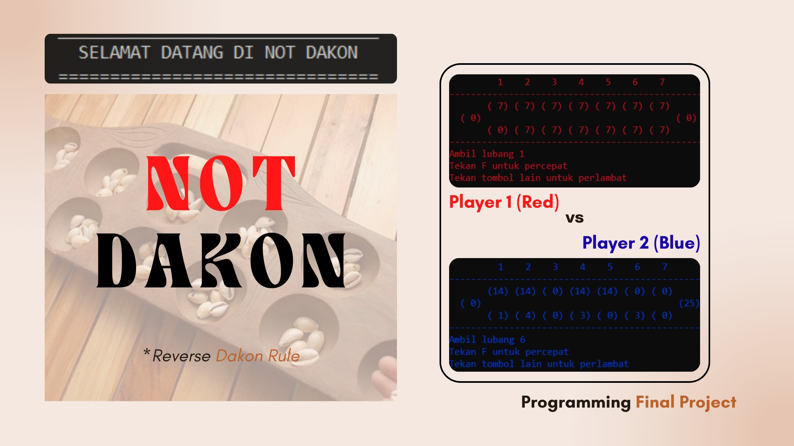

-----

# Not Dakon: A Reverse Congklak Game in C++

A simple, terminal-based implementation of the traditional Indonesian board game, Congklak, created to practice fundamental programming concepts in C++.


## 📖 About The Project

This project was born from a desire to apply basic programming principles in a fun and engaging way. We believe that learning can be exciting, which is why we chose to develop a game. C++ is a powerful and sophisticated language used across many fields, including game development, making it a perfect choice for this project. Our goal was not only to successfully implement programming fundamentals but also to have fun and create something we could enjoy.

This game is a digital version of **Congklak** (also known as Dakon), a traditional mancala-style board game popular in Southeast Asia.

## ⚙️ Getting Started

Follow these instructions to compile and run the project on your local machine.

### Prerequisites

You will need a C++ compiler installed on your system. This guide uses `g++`, which is part of the GNU Compiler Collection.

  * **g++ Compiler**
    ```sh
    # On Debian/Ubuntu
    sudo apt-get install build-essential

    # On Fedora/CentOS
    sudo yum groupinstall "Development Tools"
    ```

### Compilation & Execution

1.  **Clone the repository:**

    ```sh
    git clone https://github.com/WatsonNick/your-repository-name.git
    cd your-repository-name
    ```

2.  **Compile the source code:**
    Open your terminal and run the following command to compile the C++ files.

    ```sh
    g++ main.cpp -o congklak
    ```

    *(Replace `main.cpp` with the name of your main source file if it's different.)*

3.  **Run the game:**
    Execute the compiled file to start playing.

    ```sh
    ./congklak
    ```

## 룰 How to Play

### Game Setup

1.  The game is played by two people.
2.  The board consists of two rows of seven small holes and two large storehouses (called *lumbung*), one for each player.
3.  Each player controls the seven holes on their side of the board and the large storehouse to their right.

### Gameplay

1.  Players take turns choosing one of the small holes on their side.
2.  The player picks up all the seeds from the chosen hole.
3.  They then distribute ("sow") the seeds one by one into the next holes in a counter-clockwise direction. Sowing includes the player's own storehouse but skips the opponent's storehouse.

### Special Rules

  * **Continuing a Turn:** If the last seed sown lands in an occupied hole on the player's own side, the player picks up all the seeds from that hole and continues their turn.
  * **Capturing ("Nembak"):** If the last seed sown lands in an *empty* hole on the player's own side, the player captures all the seeds in the opponent's hole directly across from it. The captured seeds, along with the player's last seed, are placed into their own storehouse. The turn then ends.
  * **Ending a Turn:** A player's turn ends if the last seed lands in their own storehouse or in any of the opponent's small holes.

### End of Game

  * The game is over when a player has no more seeds left in any of their seven small holes.

### Winning Condition

  * The winner is the player who has the **fewest** seeds in their storehouse at the end of the game.

## 👥 Authors

  * **Nicolas Dwi Hardjoleksono** - [GitHub Username](https://github.com/WatsonNick)
  * **Zufar Athoya Bahar**
  * **Yessica Thipandona**
  * **Aizar Hafizh Soejadi**

## 📄 License

This project is licensed under the MIT License - see the [LICENSE.md](LICENSE.md) file for details.
